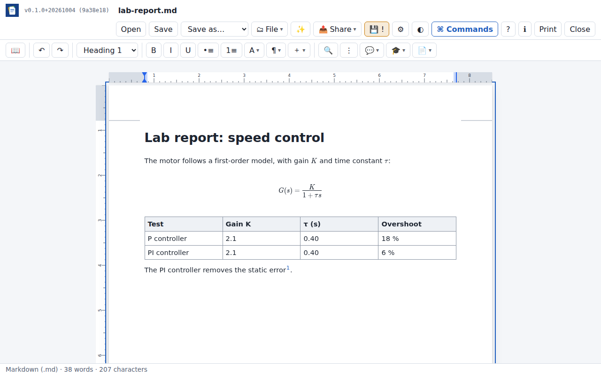
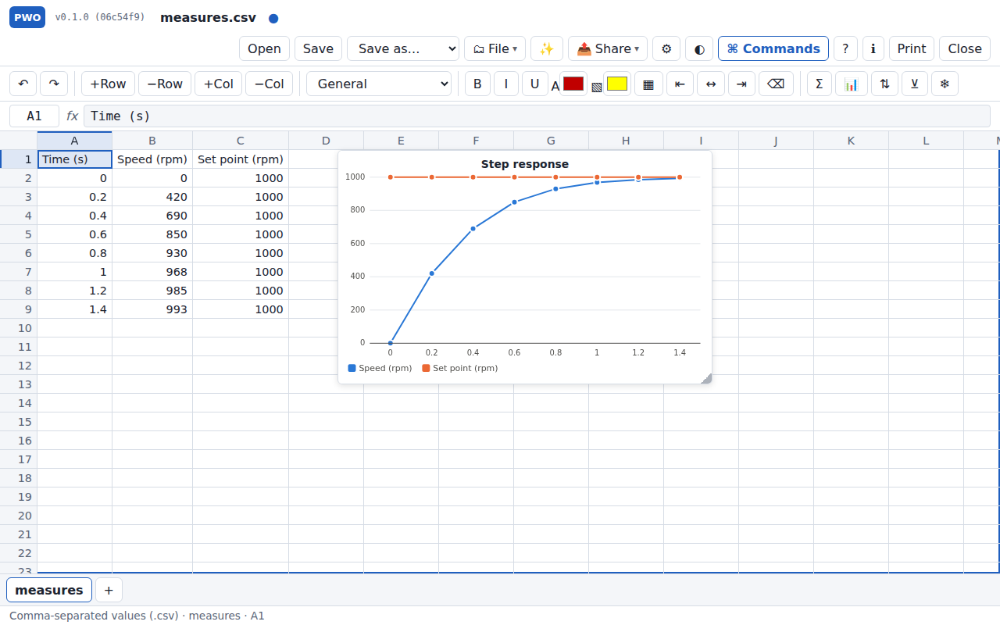
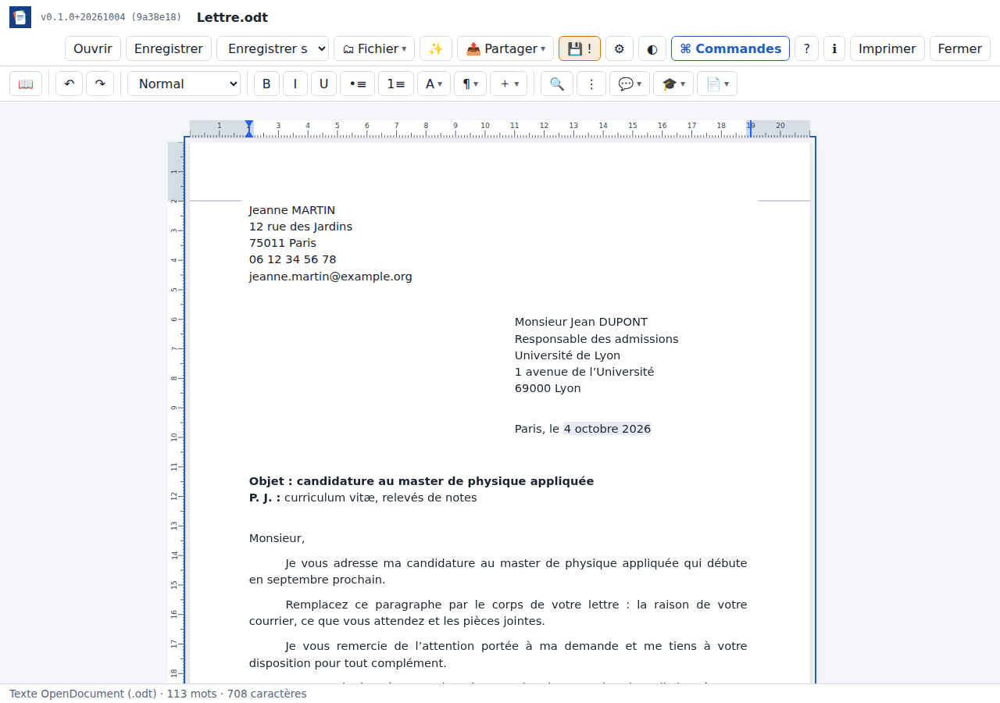
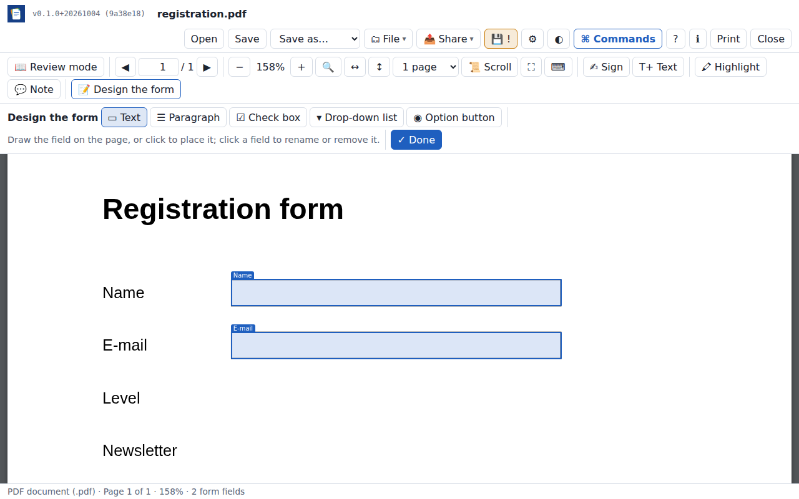
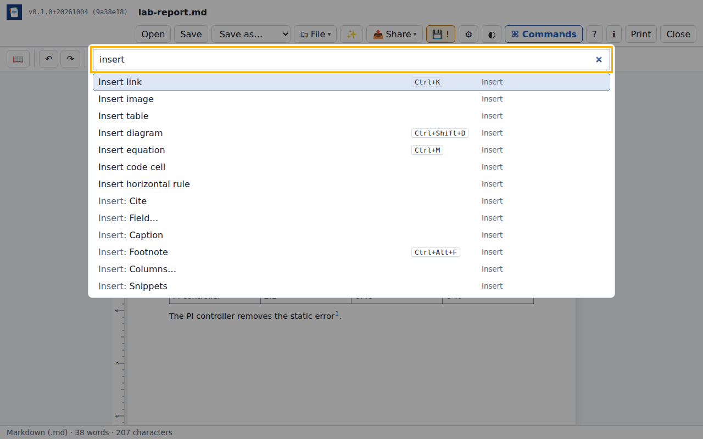
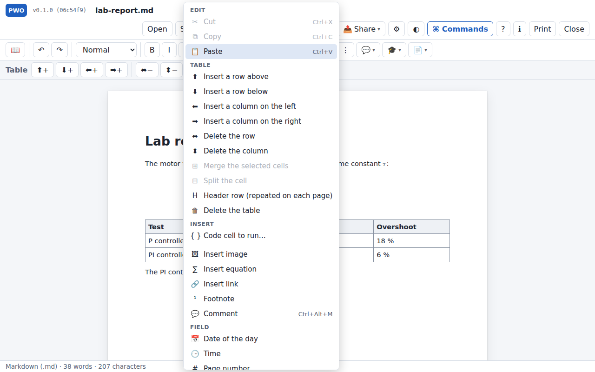

# Progressive Web Office

An office suite that runs entirely in your browser. No account, no server,
and it can even exchange documents without a network.

[](LICENSE.md)
[](https://github.com/progressive-web-office/progressive-web-office/actions/workflows/ci.yml)
[](https://github.com/progressive-web-office/progressive-web-office/actions/workflows/pages.yml)

**Try it: <https://progressive-web-office.github.io/progressive-web-office/>**
· Documentation: <https://progressive-web-office.github.io/progressive-web-office/docs/>



<!-- TODO: replace or complete with a 15 to 20 s GIF: edit a document on a
laptop, "Send to another device", QRShare shows the animated QR code, a phone
scans it and opens the document in Progressive Web Office. -->

## Why Progressive Web Office

- **Your files stay with you.** Documents are opened and saved on your
  device. Nothing is uploaded to a server of the project. The app works
  offline and can be installed like a native application.
- **Free software, open formats.** AGPL-3.0-or-later. OpenDocument is the
  default format; Microsoft Office files are read and written too.
- **Exchange without a network.** With [QRShare](https://github.com/s-celles/QRShare),
  a document goes from one device to another through animated QR codes,
  with no Wi-Fi, no Bluetooth and no cable.
- **Collaboration on isolated computers.** Several people edit the same
  text document on devices that are never online and merge their changes
  through QR codes, down to the character.

## Features

| Kind | Opens | Saves |
| --- | --- | --- |
| Text | `.odt` `.docx` `.md` `.mdz` `.tex`, LaTeX project `.zip`, `.odm` | `.odt` `.docx` `.md` `.mdz` `.tex` `.zip` |
| Spreadsheet | `.ods` `.xlsx` `.csv` `.tsv` | `.ods` `.xlsx` `.csv` |
| Presentation | `.odp` `.pptx` | `.odp` `.pptx` |
| Templates | `.ott` `.dotx` `.ots` `.xltx` `.otp` `.potx` | the same |
| PDF | `.pdf` | filled forms, signed copy |

Files up to 50 MB. Legacy binary formats (`.doc`, `.xls`, `.ppt`) are not
supported.

**Text documents**
- Character and paragraph formatting, headings, lists, tables with merged
  cells, images, links.
- Footnotes, table of contents, header and footer with page numbers, page
  breaks.
- Captions with numbered figures, tables and equations, and
  cross-references that follow renumbering.
- Citations and bibliography from BibTeX, kept as native Word sources,
  OpenDocument marks, LaTeX `\cite` or pandoc citations.
- Master documents that assemble chapters kept in separate files.
- Equations (MathLive editor, LaTeX source), Mermaid diagrams.
- Fields (date of the day, page, number of pages, title, author…) kept as
  real fields in Word and OpenDocument, and springs as in LaTeX (`\vfill`,
  `\hfill`) that fill the free space of a page or a line.
- A context menu (right click, long press or the ⋮ button) with what can be
  done where you are: table rows and columns, code cells, fields, springs…
- Python and JavaScript code cells run in a sandbox without network access:
  completion as you type, reactive cells (dependencies between cells, shown
  as a graph), interactive widgets (anywidget, including the anywidget
  instruments), code that can be hidden behind its output. Lua, SQL, C,
  C++ and R too, their runtime downloaded once you agree.
- Source files run from the code viewer, with the other files of their
  folder as a project (modules, headers, data), an optional `pwo.toml`
  naming the entry point.
- Find and replace, document properties, read-only mode, print preview.
- Templates (letter, report, minutes, exercise sheet, budget, grade book,
  invoice, talk), examples (a tour, a lab report with Python plots, one program in each language,
  interactive widgets, an instrument panel, measurements and charts), and
  your own templates.
- Review mode for text documents and PDF files: pages side by side or one
  page at a time, single-key shortcuts, comments, full screen without
  distractions.

**Spreadsheets**: formulas (44 functions), several sheets, number formats,
charts (column, bar, line, pie, scatter) saved as native charts.

**Presentations**: text boxes, shapes, images, speaker notes, slideshow.

**PDF**: viewer, form filling, drawn or imported signature (a visual
signature, not a cryptographic one), highlights and notes.

**Forms**: design a PDF form by drawing its fields (text, paragraph, check
box, drop-down list, option buttons), then compile the answers of the filled
copies into a spreadsheet — one row per file, one column per field.

**Folders**: open a folder of the device, the browser's own storage, or a
Nextcloud / WebDAV account; create, rename, move and delete files (several
at once, with undo), import files of the device, sort by name, date, size or
type, move with the keyboard; search all documents at once (names first);
links between Markdown notes (`[[note]]`) with backlinks.

**Comments**: comment text in documents, reply and resolve; kept in Word,
OpenDocument and Markdown (CriticMarkup) files.

**ZIP archives**: a ZIP file opens as a folder (archives inside it too);
documents, pictures and source files open from it, and the archive can be
downloaded with its changes.

**Source files**: C, C++, Python, Java, JavaScript, R, MATLAB, SQL and many
more open in a code editor with syntax colouring, line numbers and search.

**Working with others**
- Real-time collaboration on text documents and spreadsheets, browser to
  browser (WebRTC, end-to-end encrypted).
- Synchronisation of a text document between devices without any network,
  through QR codes shown and scanned with QRShare.
- A document carried inside a link, or a link to a document kept on a web
  server, opened read-only.
- GitHub and GitLab repositories (open and commit), Nextcloud / WebDAV,
  Grist.

**Other**: an optional AI assistant with your own key (Anthropic, OpenAI,
Mistral, Albert, Ollama on your machine, or any OpenAI-compatible server)
and WebMCP tools for browser agents; a settings window and a command
palette (**⌘ Commands**, <kbd>Ctrl</kbd>+<kbd>Shift</kbd>+<kbd>P</kbd>, a round
button on a phone) holding every action by category, with its keyboard
shortcut; English, French and Simplified Chinese; light and dark themes; a
layout for phones.



| | |
|---|---|
|  |  |
| *A letter template, dated by a field* | *Designing a PDF form* |
|  |  |
| *The command palette* | *The context menu in a table* |

## Share without a network

[QRShare](https://github.com/s-celles/QRShare) is the transfer tool built
into Progressive Web Office. It sends a file as a sequence of animated QR
codes protected by fountain codes, so the receiving phone can join at any
moment and miss frames.

- **Send**: *Send to another device…* hands the open document to QRShare in
  the browser. Small Markdown, CSV and LaTeX files (up to 16 KB) travel in
  the address; larger files go through a direct handoff between the two
  pages (`postMessage`, up to 200 MB). QRShare then shows the QR codes.
  By default it prefers transfers that need no network.
- **Receive**: *Receive from another device…* opens QRShare's scanner; once
  the file is received, its *Open in …* button (named after the address of
  Progressive Web Office) brings it back.
- Both apps are static web pages on the same site; the QRShare address can
  be changed for a self-hosted copy.

## Compared with other office suites

| | Server needed | Account needed | Works offline | Runs in a browser | License |
| --- | --- | --- | --- | --- | --- |
| Progressive Web Office | No (static files) | No | Yes | Yes | AGPL-3.0-or-later |
| LibreOffice | No | No | Yes | No (desktop app) | MPL-2.0 |
| Collabora Online | Yes | Through the hosting platform | No | Yes | MPL-2.0 |
| ONLYOFFICE Docs | Yes | Through the hosting platform | No | Yes | AGPL-3.0 (Community Edition) |
| Google Docs | Yes (Google) | Yes | Partly, after setup in Chrome | Yes | Proprietary |

Collabora and ONLYOFFICE also offer desktop applications that work offline.
Corrections are welcome: please open an issue with a source.

## Privacy

Progressive Web Office has no backend. The site only serves the
application's files. There is no telemetry, no analytics and no update
check other than the browser fetching the application itself.

Stored **in your browser only**:
- recent files (a copy of up to 12 files), the autosaved draft, the last
  opened folder (IndexedDB);
- preferences and the accounts you add for Git, WebDAV, Grist and the AI
  assistant (localStorage). AI keys are kept only if you choose to save
  them in the browser;
- documents you put in *Browser storage* (Origin Private File System);
- the templates you save (IndexedDB);
- for the synchronisation without a network: this device's key, the
  devices you trusted, the history of each synchronised document and the
  last imports (IndexedDB).

The application **goes online only when you use a feature that needs it**:

| Feature | Contacts |
| --- | --- |
| AI assistant | the provider you chose |
| Git, Nextcloud / WebDAV, Grist | the servers of the accounts you added |
| Python code cells | the jsDelivr CDN, once, for Python packages (checked against their hashes) |
| Packages and widgets installed by a cell (`pwo.install`, `importWidget`) | the site the code names, once you allowed it (the Python package index for a project name) |
| Real-time collaboration | public Nostr relays to introduce the browsers, STUN servers (Google, Cloudflare); documents travel browser to browser, encrypted |
| Link to a file on a server | that server |
| Send with QRShare, sync by QR | QRShare's page (its manifest is read to check the handoff) |

## Install and use

- **Online**: open <https://progressive-web-office.github.io/progressive-web-office/>.
  After the first visit the application also works offline.
- **Install**: Chrome and Edge on a computer show *Install* in the address
  bar; on Android, *Add to Home screen* or *Install app*; on iOS and iPadOS,
  Safari's *Share* then *Add to Home Screen*. Once installed, the app can
  open documents from the file manager and receive files shared from other
  apps, where the system supports it.
- **Browsers**: the latest versions of Chromium-based browsers (Chrome,
  Edge, Brave, Opera), Firefox and Safari are targeted. Automated tests run
  on Chromium. Writing into a local folder needs a Chromium-based browser;
  other browsers open local folders read-only.

## Development

Requirements: Node.js 20 or later, [just](https://github.com/casey/just).

```sh
just install    # npm ci
just dev        # development server
just test       # unit tests (Vitest)
just e2e        # end-to-end tests (Playwright, builds first)
just check      # type checking, unit tests, build and documentation
just docs-dev   # documentation site
```

The code is TypeScript without a UI framework, built with Vite. See
[docs/development.md](docs/development.md) and
[docs/architecture.md](docs/architecture.md). Requirements are listed in
[docs/requirements.md](docs/requirements.md).

## Roadmap

- Offline synchronisation of spreadsheets; comments and changes shared in
  real-time sessions.
- More spreadsheet functions, fill handle, conditional formatting.
- Editing modes (visual, source), mail merge, form fields.
- More ipywidgets controls, computer algebra in cells.
- Minimal photo editing and vector drawing.

The full list is in [ROADMAP.md](ROADMAP.md); changes are in
[CHANGELOG.md](CHANGELOG.md). The project is in initial development
(`0.x`): 0.1.0 is its first minor release.

## Contributing

Contributions are welcome: see [CONTRIBUTING.md](CONTRIBUTING.md), the
[Code of Conduct](CODE_OF_CONDUCT.md) and the [security policy](SECURITY.md).

## Author

[Sébastien Celles](https://github.com/s-celles).

## License

[GNU Affero General Public License v3.0 or later](LICENSE.md).
