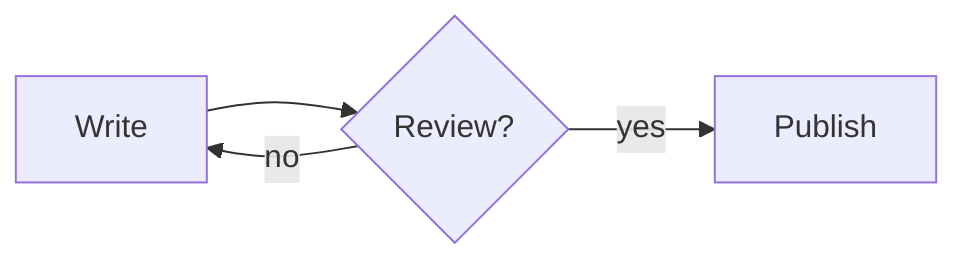

# Diagrams

Text documents can contain diagrams written in
[Mermaid](https://mermaid.js.org/), a text syntax for flowcharts, sequence
diagrams, class and state diagrams, entity-relationship diagrams, Gantt
charts, pie charts, mind maps and more.

## Inserting and editing

1. Click **⧉** in the toolbar (or press <kbd>Ctrl</kbd>+<kbd>Shift</kbd>+<kbd>D</kbd>).
2. Pick a starting point in **Start from a template…**, or type the source
   directly. The preview on the right updates as you type; if the source
   contains an error, the message is shown below and the source is kept.
3. Click **Insert**: the diagram is added on its own line after the current
   paragraph.

Click a diagram in the document to edit it. A diagram whose source is invalid
is shown as its source, outlined in red; hover it to see the error.

For example:

````md

````

The **Mermaid syntax** link in the dialog opens the syntax reference.

## Offline and safe

The diagram engine is part of the application and is loaded only when a
document contains or inserts a diagram; it works offline. Diagrams are
rendered in Mermaid's *strict* security mode and displayed as images, so a
diagram cannot run scripts, open links or load anything from the network.

## Storage in each format

| Format | Diagram |
|--------|---------|
| Markdown / MDZ | a fenced code block whose language is `mermaid` (as on GitHub, GitLab and most Markdown tools) |
| Word (`.docx`) | a PNG picture titled `mermaid`, whose description (alternative text) is the Mermaid source |
| OpenDocument (`.odt`) | a PNG picture with `<svg:title>mermaid</svg:title>` and the source in `<svg:desc>` |
| LaTeX project (`.zip`) | `\includegraphics` of a PNG file, preceded by the source as `%` comments |
| LaTeX (`.tex`) | the source in a `verbatim` block (a single `.tex` file cannot carry the picture) |

Word, LibreOffice and other applications display the picture; Progressive
Web Office reads the source back, so the diagram stays editable. If a
diagram cannot be rendered when saving (invalid source), its source is
written as text so nothing is lost.

When printing, diagrams are printed as vector graphics.

The [AI assistant](./assistant.md) reads and writes diagrams as `mermaid`
code blocks too, so you can ask it to draw or update one.
